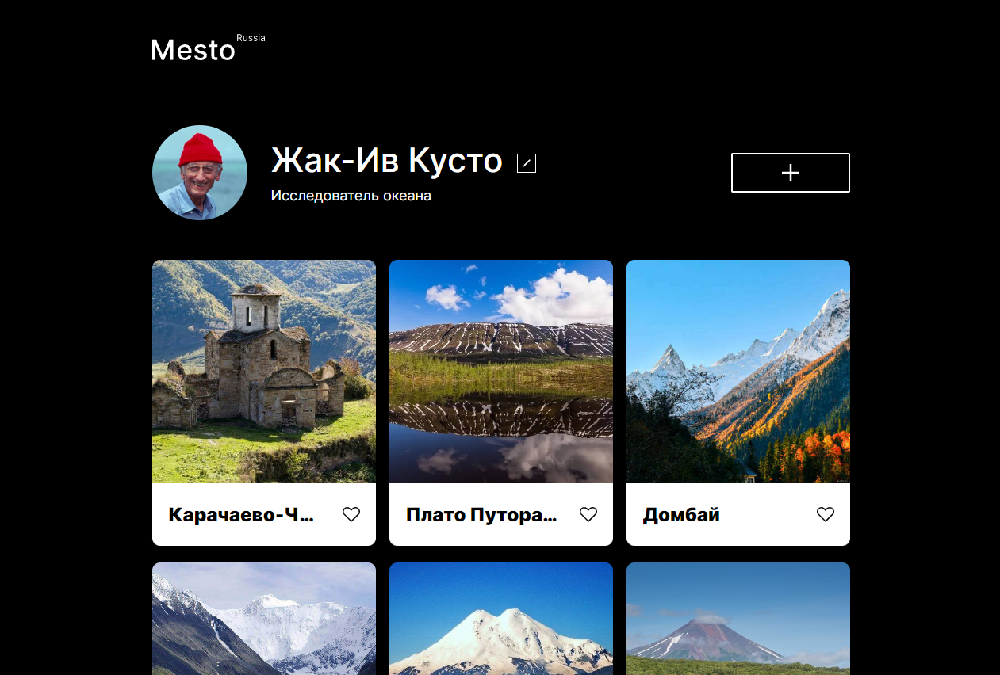

# Название проекта: **Mesto Russia**

## Описание проекта:
Сайт создан с целью ознакомления посетителей с интересными местами России, которые посетил указанный на странице путешественник. Места проиллюстрированы фотографиями.

## Технологии и функциональность:
* HTML
* CSS
* Flexbox
* Адаптивная верстка для разрешений от 320 до 1280 пикселей через применение @media.
* BEM Nested
* Использованы ES-6 классы.
* Применяется ООП.
* Webpack
* Настроена минификация и транспиляция JS-Babel
* Использован API Яндекс.Практикум.
* Реализованы модальные окна добавления новой фотографии, изменения данных автора страницы, изменения аватара автора.
* Реализовано модальное окно просмотра фотографии.
* Модальные окна закрываются по кнопке закрытия, по нажатию на Esc и по клику вне модального окна.
* Реализовано добавления Лайка для фотографии.
* Реализовано удаление фотографии.
* Карточки, полученные с сервера, добавляются на страницу с помощью JS.
* Реализована валидация изменения данных - для проверки данных в поле используются HTML5-атрибуты и JS-свойство ValidityState.
* Кнопка отправки формы неактивна, если хотя бы одно из полей не проходит валидацию.

## Планы по доработке:
Перенос проекта на React.

## Ссылка на дeплой проекта:
[GitHub Pages](https://kpolllka.github.io/mesto/)
